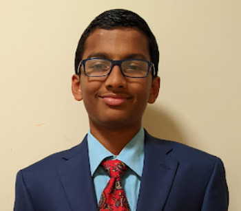
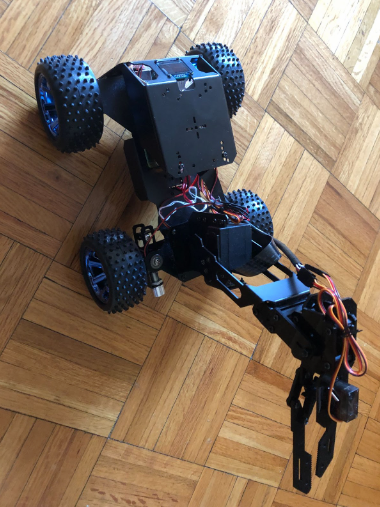

# Ball Tracking Robot
  A robot that can track any object and go towards it and pick it up. This robot also has gesture control capabilities. The initial ball tracking robot was completed in the first three milestone videos and the v1.0.0 documentation. The second robot (Knight Rider) was built and completed in the last three milestone videos and the v2.0.0 documentation.

| **Engineer** | **School** | **Area of Interest** | **Grade** |
|:--:|:--:|:--:|:--:|
| Shreyans D | Stamford Highschool | Computer Science & Mechanical Engineering | Incoming Sophmore

## [Documentation (v2.0.0)](./Work.pdf)

## [Documentation (v1.0.0)](./Documentation.pdf)

# Sixth Milestone

My sixth and final milestone was to create a Flask web application that would allow the user to graphically control the HSV values so that they can track whatever they want. To provide the user with a graphical preview we had to run the binary image generation and the Flask application at the same time. However, this is not possible in one program because of the Global Interpreter Lock. To accomplish this we ended up writing a shell script that started the binary image generation code first and then backgrounded it. Then it also started the Flask web application which allowed the user to have a live preview. Finally, I integrated the Bluetooth movement code with the new robot. This was pretty simple as the Bluetooth communication code was the same. The only thing that I needed to change was how the robot would move in response to the Bluetooth gestures.

<iframe width="650" height="365.625" src="https://www.youtube.com/embed/sx_afc21ENo" title="YouTube video player" frameborder="0" allow="accelerometer; autoplay; clipboard-write; encrypted-media; gyroscope; picture-in-picture" allowfullscreen></iframe>

# Fifth Milestone

My fifth milestone was to figure out how to control the servo motors. We found an Adafruit library that allowed us to easily control the servo motors. Once we were able to control the servo motors we finished integrating the movement code as now we could move the front servo to turn the front wheels in the direction that we wanted the car to move in. With the car movement properly integrated, we moved on to trying to make the robotic arm pick up the object. We decided to use inverse kinematics to move the robotic arm. We implemented this by creating a triangle whose side lengths included the “forearm” of the robotic arm, the “palm of the robotic arm”, and the distance between the robot and the arm. With these lengths, we were able to calculate the angles of the triangle. We then made the servos rotate to that particular angle using some additional software. The final modification we made to make the system more accurate was to rotate the arm in a particular direction depending on where the center was in the final image after the robot had stopped. This guaranteed that the robot would successfully pick up the object every time. Finally, we got the OLED display and the LEDs working as well.

<iframe width="650" height="365.625" src="https://www.youtube.com/embed/t445_ueNsNQ" title="YouTube video player" frameborder="0" allow="accelerometer; autoplay; clipboard-write; encrypted-media; gyroscope; picture-in-picture" allowfullscreen></iframe>

# Fourth Milestone

  My 4th milestone was to accurately measure how far the robot was from the object so that we could later program the robotic arm to go and pick up the object. Our first idea was to perform linear regression and find a linear pattern between the number of white pixels and the distance from the ball. This failed because the area of the object gets quartered while the distance only gets halved. Hence we decided to use another concept called focal distance. Focal distance allows us to accurately calculate the distance between the robot and the object using the width of the object and the perceived width of the object in the picture. (If you want to know more, you can look at my documentation, which is linked above). Once we had this working I decided to build my robot kit (It took approximately 8 hours) and tried to integrate our old image processing and movement code with the new hardware. This image processing was relatively simple to integrate but the movement was slightly more challenging as this robot was designed differently. 
  
<iframe width="650" height="365.625" src="https://www.youtube.com/embed/p-Dlue6etSo" title="YouTube video player" frameborder="0" allow="accelerometer; autoplay; clipboard-write; encrypted-media; gyroscope; picture-in-picture" allowfullscreen></iframe>

# Third Milestone

  For my third and final milestone, we finished my project. We started by connecting the H-bridge to the Raspberry Pi’s GPIO pins and the motors. We then wrote software that the robot could use to move towards the ball. The software included different functions that could be used to move in different directions and the software would come up with a sequence of movements that would move it closer to the ball. Once we had the ball detection robot working, we moved on to connecting the Bluetooth module to the Raspberry Pi. Once we paired the two devices together, we wrote software that would allow the accelerometer to detect tilt and for the Arduino to process it and tell the Bluetooth module to send a unique command to the Raspberry Pi. Upon receiving the command the Raspberry Pi would make the robot move in the appropriate direction. Plus, we made it so that if the accelerometer were to be flat, then the robot would automatically go into ball detection mode. 

<iframe width="650" height="365.625" src="https://www.youtube.com/embed/OHF286y9-uI" title="YouTube video player" frameborder="0" allow="accelerometer; autoplay; clipboard-write; encrypted-media; gyroscope; picture-in-picture" allowfullscreen></iframe>

# Second Milestone

  For my second milestone, we wanted to be able to filter out a ball from the image. This time we just used a different way to create the binary image which would allow for more accurate contour detection. We first applied a Gaussian blur which would improve the average color of a block in the image. Then we would create a different cutoff value for each 601-601 box which would allow for more accurate binary image generation. This is called Adaptive Binary image generation. However, this failed because we just weren’t able to filter out the ball reliably enough. For the third and final iteration of the software, we decided to use image masking to create the binary image. To do this, we first changed the camera configuration from stream_configuration to still_configuration. This allowed us to easily convert the image to HSV. We then filtered out the color of the ball through image masking. We then generated a binary image and counted the number of white pixels to detect if the ball was actually in the image and then we took the average location of all the white pixels to compute the center of the ball. We also finished the hardware assembly of the project and wired everything up. We also set up the circuit for the Bluetooth module, Arduino, and the accelerometer. The accelerometer would detect tilt, the Arduino would process it, and the Bluetooth module would send it to the Raspberry Pi. However, we still need to connect the Bluetooth module to the Raspberry Pi. 

<iframe width="650" height="365.625" src="https://www.youtube.com/embed/CSiML7SuItQ" title="YouTube video player" frameborder="0" allow="accelerometer; autoplay; clipboard-write; encrypted-media; gyroscope; picture-in-picture" allowfullscreen></iframe>

# First Milestone

  My first milestone was to get my Raspberry Pi setup properly with all of the packages and libraries and complete a basic contour detection program. First, we tried to set up the Raspberry Pi on the 64-bit OS. We tried to set up the camera with the Raspberry Pi but it didn’t work because there was new camera software installed. When we disabled the Libcamera, the VNC would not work. Hence we re-setup the raspberry pi with the 32-bit os and this worked. Then we tried to reinstall OpenCV but it would not work. Hence we installed a new camera module named Picamera2 to get the output from the camera since the Open-CV video capture does not work. After doing all of this we were able to get the camera output working. We then moved on to working on the software. First, we tried to detect all of the contours, or blobs of color, in the image. This attempt failed because we were unable to filter out our ball from the image. 

<iframe width="650" height="365.625" src="https://www.youtube.com/embed/g0bbrq72xtk" title="YouTube video player" frameborder="0" allow="accelerometer; autoplay; clipboard-write; encrypted-media; gyroscope; picture-in-picture" allowfullscreen></iframe>
